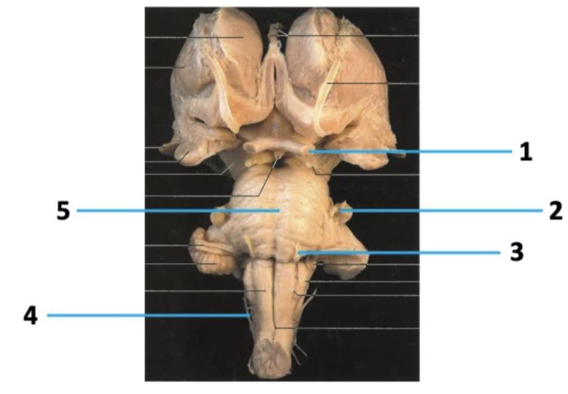
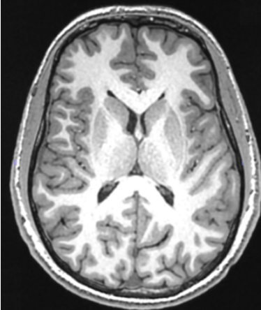

# Gedankenprotokoll - Anatomie - SoSe 2022

## Teil I - 20 Fragen:

### ID: `#ANA-22S002`

> Q: Was bezeichnet der Begriff "eparteriell"?
>
> - A: Lage der Aorta ascendens
> - B: Lage des rechten Bronchus lobaris superior
> - C: Lage der Lunge zur Aorta ascendens
> - D: Lage des linken Bronchus
> - E: Lage der Vena cava superior
>
> A: B

### ID: `#ANA-22S004`

> Q: Welche Aussage zur Nebenniere ist falsch?
>
> - A: Sie hat drei versorgende Arterien.
> - B: Sie besitzt 3 abführende Venen.
> - C: Sie projiziert sich auf Th11, Th12
> - D: Sie hat eine enge Lagebeziehung zum N. splanchicus Major.
> - E: Sie liegt in der Capsula adiposa
>
> A: B

### ID: `#ANA-22S006`

> Q: **Welche Zuordnung ist falsch**
>
> 
>
> - A: 1 N. opticus
> - B: 2 N. trigeminus
> - C: 3. N. trochlearis
> - D: 4. N. accessorius
> - E: 5. Pons
>
> A: C

### ID: `#ANA-22S008`

> Q: 
>
>
> **Auf diesem MRT-Schnittbild fehlt**
>
> - A: das Caput des Nucleus caudatus
> - B: das Foramen interventriculare
> - C: die Columna fornicis
> - D: der Plexus chorioideus
> - E: die Apertura mediana
>
> A: E